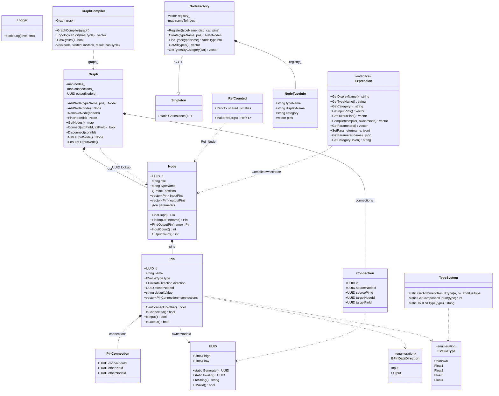

# 材质编辑器类图（课1-5 已实现部分）

> Mermaid 版本可在 GitHub / VSCode / Typora 直接预览。
> 如果 Mermaid 不显示，看下方 ASCII 版。

---

## 一、Mermaid 版



---

## 二、ASCII 速览

```
                    Core（基础设施）
   ┌──────────────┐    ┌────────────────────┐   ┌──────────────────┐
   │    UUID      │    │   RefCounted       │   │  Singleton<T>    │
   │ + Generate   │    │ Ref = shared_ptr   │   │  (CRTP 单例基类) │
   │ + IsValid    │    │ + MakeRef<>()      │   │  + GetInstance() │
   └──────┬───────┘    └────────────────────┘   └────────┬─────────┘
          │                                              │
          │ referenced by UUID                            │ extends
          │                                              ▼
   ───────┼──────────────────────────────────────────────────────────
          ▼
                    MaterialGraph（数据模型）

   ┌─────────────────────┐    ┌────────────┐
   │  EPinDataDirection  │    │ EValueType │
   │   Input / Output    │    │ Float1..4  │
   └─────────────────────┘    └─────┬──────┘
                                    │
   ┌──────────────────────────────┼────────────────────────────────┐
   │                              ▼                                │
   │   ┌──────────────────────────────────────────────────────┐    │
   │   │                          Pin                          │    │
   │   │  + id, name, type, direction                          │    │
   │   │  + ownerNodeId : UUID                                  │    │
   │   │  + defaultValue : string                               │    │
   │   │  + connections : vector<PinConnection> ──┐             │    │
   │   │  + CanConnectTo(other) : bool            │             │    │
   │   └──────────────────────────────────────────┼─────────────┘    │
   │                                              │                  │
   │                                  ┌───────────▼──────────────┐   │
   │                                  │   Pin::PinConnection     │   │
   │                                  │   + connectionId : UUID  │   │
   │                                  │   + otherPinId : UUID    │   │
   │                                  │   + otherNodeId : UUID   │   │
   │                                  └──────────────────────────┘   │
   │                                                                 │
   │   ┌──────────────────────────────────────────────────────────┐ │
   │   │                          Node                              │ │
   │   │  + id, title, typeName, position                           │ │
   │   │  + inputPins  : vector<Pin>  ◄──┐                          │ │
   │   │  + outputPins : vector<Pin>     │ contains                 │ │
   │   │  + parameters : json            │                          │ │
   │   │  + FindPin / FindInputPin                                  │ │
   │   └─────────────────────────────────┼──────────────────────────┘ │
   │                                      │                          │
   │   ┌──────────────────────────────────┼───────────────────────┐  │
   │   │                Graph : public QObject                     │  │
   │   │                                                            │  │
   │   │  - nodes_       : map<UUID, Ref<Node>>  ◄── 拥有所有权      │  │
   │   │  - connections_ : map<UUID, Connection>                    │  │
   │   │  - outputNodeId_: UUID                                      │  │
   │   │                                                            │  │
   │   │  + AddNode / RemoveNode / FindNode                         │  │
   │   │  + Connect / Disconnect                                    │  │
   │   │  + GetOutputNode                                           │  │
   │   │                                                            │  │
   │   │  «signals» NodeAdded / NodeRemoved                         │  │
   │   │           ConnectionAdded / ConnectionRemoved              │  │
   │   │           GraphChanged                                     │  │
   │   └────────────────────────────────────────────────────────────┘  │
   │                                                                    │
   │   ┌──────────────────────────────┐                                 │
   │   │       Connection (struct)    │                                 │
   │   │  + sourceNodeId, sourcePinId │                                 │
   │   │  + targetNodeId, targetPinId │                                 │
   │   └──────────────────────────────┘                                 │
   └────────────────────────────────────────────────────────────────────┘

   ┌──────────────────────────────────────────────────────────────────┐
   │                    NodeFactory : Singleton<NodeFactory>          │
   │  - registry_     : vector<NodeTypeInfo>                          │
   │  - nameToIndex_  : map<string, size_t>                           │
   │  + Register / Create / FindType / GetAllTypes                    │
   │  contains NodeTypeInfo { typeName, displayName,                  │
   │                            category, vector<PinTemplate> }       │
   └──────────────────────────────────────────────────────────────────┘

   ┌──────────────────────────────────────────────────────────────────┐
   │                       GraphCompiler                              │
   │  - graph_ : Graph*                                               │
   │  + TopologicalSort(hasCycle*) : vector<Node*>                    │
   │  + HasCycles() : bool                                            │
   │  - Visit(...)  (DFS 后序)                                         │
   └──────────────────────────────────────────────────────────────────┘

                    Compiler（部分实现）
   ┌─────────────────────────────────────┐
   │            TypeSystem               │  课5 已实现
   │  + static GetArithmeticResultType   │
   │  + static GetComponentCount         │
   │  + static ToHLSLType                │
   └─────────────────────────────────────┘
   ┌─────────────────────────────────────┐
   │     MaterialCompiler   ⏳ 课6        │
   │     CodeChunk          ⏳ 课8        │
   │     HLSLGenerator      ⏳ 课8        │
   └─────────────────────────────────────┘

                    Expression（抽象）
   ┌──────────────────────────────────────────────────────────────────┐
   │                «interface»  Expression                            │
   │   + abstract GetDisplayName / GetTypeName / GetCategory           │
   │   + abstract GetInputPins  / GetOutputPins                        │
   │   + abstract Compile(compiler, ownerNode)                         │
   │   + virtual  GetParameters / SetParameter / GetParameter          │
   │   + virtual  GetCategoryColor                                     │
   │                                                                    │
   │   ⏳ 子类（课7）: ExprAdd, ExprConstant, ExprParameter, ...        │
   └──────────────────────────────────────────────────────────────────┘
```

---

## 三、关系说明

| 关系 | 含义 |
|---|---|
| `NodeFactory --\|> Singleton` | CRTP 单例 |
| `Graph *-- Node` | 组合（拥有 Ref<Node>） |
| `Graph *-- Connection` | 组合 |
| `Node *-- Pin` | 组合 |
| `Pin *-- PinConnection` | 组合 |
| `GraphCompiler ..> Graph` | 依赖（只读指针） |
| `Graph ..> Node` | 依赖（按 UUID 查找） |
| `Pin ..> UUID` | 引用（ownerNodeId） |

---

## 四、查看方式

VSCode 里：
1. 已装 `bierner.markdown-mermaid` 和 `shd101wyy.markdown-preview-enhanced`
2. 打开此 `.md` 文件
3. 按 `Ctrl + Shift + V` 打开预览
4. 找到"一、Mermaid 版"那一节，类图会自动渲染

如果 Mermaid 还是渲染失败，请告诉我具体报错信息，或直接看下方 ASCII 版（控制台 `type` 也能看）。
